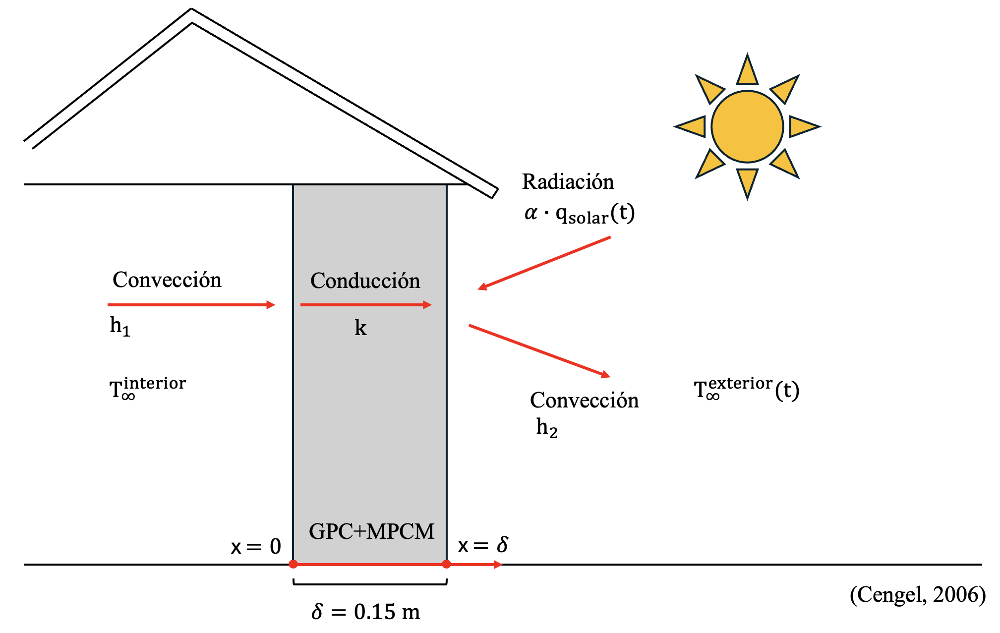
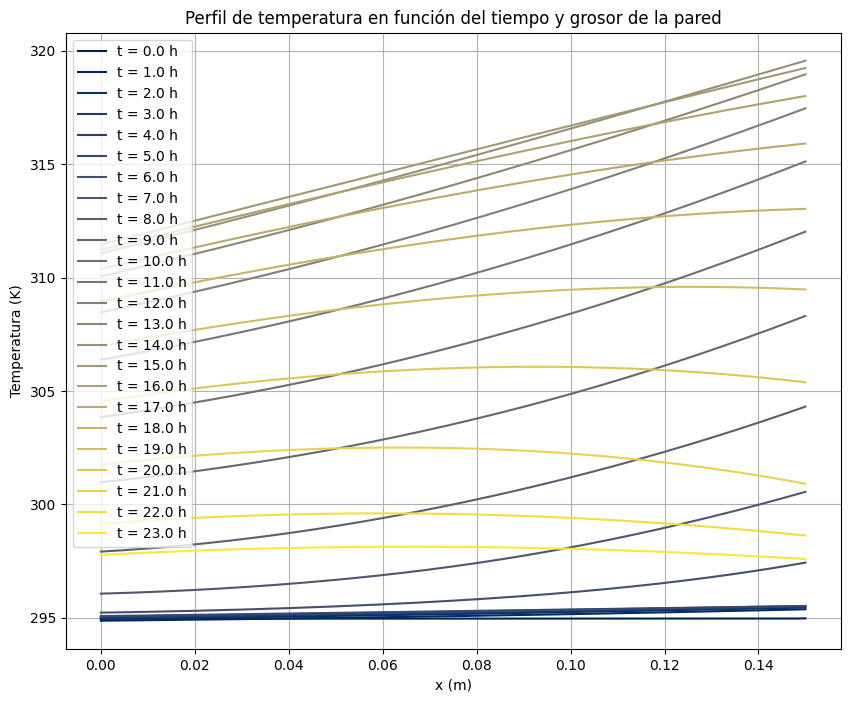

# Grupo_1_IIQ2003
Caracterización del perfil de temperatura en paredes residenciales en Santiago de Chile, considerando materiales de cambio de fase (MPCM), con el objetivo de evaluar su efectividad en el aislamiento térmico.

## Descripción general del proyecto

El proyecto permite caracterizar el perfil de temperatura en paredes residenciales en Santiago de Chile, el cual está gobernado por conducción de calor a través de su espesor. Se centra en un geopolímero de concreto (GPC) con material microencapsulado de cambio de fase (MPCM). A partir de ello, busca evaluar su efectividad en el aislamiento térmico considerando las variaciones en la capacidad calorífica del material con la temperatura.

La principal problemática que aborda el proyecto es el alto consumo energético, emisiones de dióxido de carbono e ineficiencia en el aislamiento térmico. En Chile, el sector residencial representa cerca del 15% del consumo total de energía y el 5% de las emisiones nacionales de dióxido de carbono, siendo la calefacción la principal fuente de consumo [1]. Como consecuencia, una mejora en el área permitirá incrementar la eficiencia energética y reducir la contaminación, lo cual beneficiará a las futuras generaciones [2]. A su vez, se estima que más del 60% de las viviendas carece de aislación térmica adecuada, lo que incrementa la vulnerabilidad energética de los hogares y los expone a condiciones extremas de frío y calor, contaminación intradomiciliaria y altos costos de calefacción [3]. Como consecuencia, disminuye considerablemente la calidad de vida de las personas. 

En Chile, existe una importante problemática para mantener condiciones térmicas adecuadas dentro del hogar debido a la baja calidad constructiva y la ausencia de aislación [4]. Miles de familias deben destinar una proporción significativa de sus ingresos a calefacción para alcanzar temperaturas mínimas de confort, sin lograrlo en muchos casos [5]. Esta situación que genera un círculo de desigualdad, donde familias quedan expuestas a enfermedades respiratorias y contaminación intradomiciliaria, enfrentando altos costos energéticos que afectan su presupuesto mensual [6]. En este contexto, mejorar el aislamiento térmico de muros y techos puede reducir la demanda energética hasta en un 40%, mejorando el bienestar y salud de las familias [4]. 

La carencia de un buen aislamiento térmico ha impulsado al Estado a implementar proyectos relacionados con la sustentabilidad, respondiendo a la urgencia de optimizar el uso energético y reducir el impacto económico y ambiental del país [7]. Uno de ellos es la actualización de la reglamentación térmica en la Ordenanza General de Urbanismo y Construcciones (OGUC), que incorpora exigencias para las infraestructuras de establecimientos educacionales y de salud. El Ministerio de Vivienda y Urbanismo presenta una serie de beneficios de este cambio: permitirá mantener una temperatura cómoda, mejorar calidad del aire interior, evitar patologías constructivas por condensación, reducir el uso de leña, disminuir las emisiones de material particulado y contribuir al ahorro en calefacción [8]. Esto confirma la pertinencia del proyecto frente a las necesidades del país, el que se plantea como una contribución al esfuerzo de mejorar la calidad de vida de los habitantes y proteger el medio ambiente. 

## Explicación breve del sistema modelado

El proyecto permite caracterizar el perfil de temperatura en paredes residenciales en Santiago de Chile, el cual está gobernado por conducción de calor a través de su espesor. Esta condición nos permite modelar el problema de forma unidimensional, dado que las variaciones laterales de temperatura son despreciables en comparación al gradiente dominante en el eje normal a la superficie. Esta aproximación es aceptable en geometrías donde una dimensión es significativamente menor que las otras, ya que la conducción se concentra casi exclusivamente en la dirección reducida [10]. A la vez, se plantea un modelo transiente que incluye las variaciones en las condiciones ambientales a lo largo del día, tanto de temperatura exterior como de radiación.

Luego, se definieron los principales fenómenos de transporte involucrados. De forma más relevante, se debe considerar la transferencia de calor por conducción a lo largo del espesor de la pared. A la vez, existe transferencia de calor por convección natural, tanto hacia el interior como el exterior de la vivienda. Para el interior, se consideró una temperatura constante de 21°C. Para el exterior, se consideró una variación temporal senoidal de temperatura durante el verano. Por último, se debe incluir el calor absorbido por radiación solar, asumiendo una variación senoidal a lo largo del día.

Para modelar el sistema, se consideraron 5 supuestos relevantes. En primer lugar, la transferencia de calor a través de la pared es unidimensional en el eje x. Además, no hay ninguna fuente de generación de energía dentro de la pared. A la vez, el aislante dentro de la pared está distribuido de forma homogénea y es isotrópico. Por otro lado, la densidad y conductividad térmica del material son constantes. Finalmente, se puede despreciar la convección forzada, asumiendo que la velocidad del viento es suficientemente baja. A continuación, se presenta un esquema del sistema.

## Descripción del método numérico utilizado

A partir de los supuestos realizados, se pudo modelar el problema mediante la ecuación de conservación de energía:

$$\rho c_p \left( \frac{\partial T}{\partial t} + v_x \frac{\partial T}{\partial x} + v_y \frac{\partial T}{\partial y} + v_z \frac{\partial T}{\partial z} \right) = k \left( \frac{\partial^2 T}{\partial x^2} + \frac{\partial^2 T}{\partial y^2} + \frac{\partial^2 T}{\partial z^2} \right) + \mu\phi_v$$

Se consideró que las velocidades en todos los ejes son 0, ya que se está modelando un sólido. Además, solo nos interesa el transporte transiente en la dirección x. Por lo tanto, el sistema se simplifica a a siguiente ecuación:

$$
\rho c_p \frac{\partial T}{\partial t}
= k \frac{\partial^2 T}{\partial x^2}
$$

Considerando que la capacidad calorífica varía con la temperatura, se puede modelar mediante las siguientes ecuaciones, considerando que su temperatura de fusión (Tm) es igual a 23,7°C:

$$
C_p(T) =
\begin{cases}
C_{p0}+h\cdot \dfrac{w_l^{2 m_l}}
{w_l^2+(2^{\frac{1}{m_l}}-1)\cdot (2T-2T_m)^2}, & T \le T_m \\
C_{p0}+h\cdot \dfrac{w_r^{2 m_r}}
{w_r^2+(2^{\frac{1}{m_r}}-1)\cdot (2T-2T_m)^2}, & T > T_m
\end{cases}
$$

Además, se planteó 1 condición inicial y 2 condiciones de borde. La condición inicial considera que la temperatura en el tiempo 0 es conocida. La primera condición de borde considera la transferencia de calor por convección hacia el interior de la vivienda, asumiendo que esta mantiene una temperatura constante de 21°C. La segunda condición de borde incluye la transferencia de calor por convección hacia el exterior de la vivienda, así como por radiación. Para este caso, se considera que tanto la temperatura exterior como radiación solar varían de forma senoidal a lo largo del día:

$$
\text{1) Condición inicial: } \quad T(x, t=0) = T_0
$$

$$
\text{2) Condición borde 1:} \quad
-k \frac{\partial T(x=0)}{\partial x} = h_1 \left( T_\infty^{\text{interior}} - T(x=0) \right)
$$

$$
\text{3) Condición borde 2:} \quad
-k \frac{\partial T(x=\delta)}{\partial x}= h_2 \left( T(x=\delta) - T_\infty^{\text{exterior}}(t) \right)- \alpha q''_{solar}(t)
$$

donde $T_\infty^{\text{exterior}(t)}$ y $q''_{solar}(t)$ son funciones senoidales en función del tiempo:

$$
T_\infty^{\text{exterior}}(t)= \frac{T_{\max} + T_{\min}}{2}+ \frac{T_{\max} - T_{\min}}{2}\sin\left( \frac{\pi}{43200} t - \frac{2\pi}{3} \right)
$$

$$
q''_{solar}(t) = 
\begin{cases}
0, & 21{:}00 \le t \le 5{:}00 \\
q_{s,\max} \, \sin\left( \frac{\pi}{57600}\, t - \frac{5\pi}{16} \right),
& 5{:}00 < t < 21{:}00
\end{cases}
$$

Luego, se puede discretizar la ecuación diferencial y las condiciones de borde. Para la ecuación diferencial, se considera una aproximación hacia adelante de primer orden para la derivada temporal, y una aproximación central de segundo orden para la derivada espacial. Para la condición inicial, se reemplaza en el nodo de tiempo 0. Para la condición de borde 1, se usa una aproximación hacia adelante de segundo orden. Para la condición de borde 2, se usa una aproximación hacia atrás de segundo orden. A continuación, se muestra la forma en que se despeja la discretización de la ecuación diferencial.

$$
\rho\ c_p\\frac{T_i^{j+1} - T_i^{j}}{\Delta t}=k\frac{T_{i+1}^{j} - 2T_i^{j} + T_{i-1}^{j}}{\Delta x^2}
$$

$$
\frac{\rho\ c_pT_i^{j+1}}{\Delta t} = \frac{\rho\ c_pT_i^{j}}{\Delta t}+k\frac{T_{i+1}^{j} - 2T_i^{j} + T_{i-1}^{j}}{\Delta x^2}
$$

$$
T_i^{j+1} = T_i^{j} + \Delta t \frac{k}{\rho c_p\Delta x^2} (\{T_{i+1}^{j} - 2T_i^{j} + T_{i-1}^{j} \}) 
$$

Luego, las condición inicial queda:

$$
\quad T_i^{j=0} = T_0
$$

La condición de borde 1 se simplifica:

$$
k \cdot \frac{3T_i^j - 4T_{i+1}^{j} + T_{i+2}^{j}}{2\Delta x} = h_1 \left( T_\infty^{\text{interior}} - T_i^j \right)
$$

$$
T_i^j = \frac{k}{3k + 2h_1\Delta x} \left( 4T_{i+1}^{j} - T_{i+2}^{j} \right) + \frac{h_1 \cdot T_\infty^{\text{interior}} 2\Delta x}{3k + 2h_1\Delta x}
$$

Finalmente, la condición de borde 2 se simplifica:

$$
k \cdot \frac{-3T_i^j + 4T_{i-1}^{j} - T_{i-2}^{j}}{2\Delta x} = h_2 \left( T_i^j - T_\infty^{\text{exterior}} \right) -\alpha q_{solar}
$$

$$
T_i^j = \frac{1}{-\frac{3}{2\Delta x}-h_2}\left(\frac{k}{2\Delta x} \left(- 4T_{i-1}^{j} + T_{i-2}^{j} \right) - h_2 T_\infty^{\text{exterior}} -\alpha q_{solar}\right)
$$

Para resolver el sistema, se utilizarán dos métodos numéricos acoplados. En primer lugar, se implementará el método forward time centred space (FTCS) para resolver el sistema. Se inicia el esquema FTCS para cada instante de tiempo t. Dado que la capacidad calorífica ($c_p$) varía con la temperatura, se implementa el método de punto fijo para construir una matriz A que también dependa de la temperatura. Luego, para cada instante de tiempo, se define una temperatura intermedia. A partir de esta, se calcula la matriz A que contiene los coeficientes del método FTCS y se calcula una nueva temperatura. Una vez que el método converge, se continua con la aplicación del algoritmo FTCS. Esto significa que se actualizan los nodos interiores y condiciones de borde. Este procedimiento se repite para todos los instantes de tiempo, 

Por un lado, el algoritmo FTCS...

Por el otro lado, el método del punto fijo...

## Instrucciones para ejecutar el código

1. Importar módulos: el primer paso consiste en importar los módulos que nos servirán para resolver el problema computacional. En específico, necesitamos 3 módulos:
- numpy: permite realizar operaciones matemáticas y construir vectores y matrices multidimensionales.
- matplotlib.pyplot: permite realizar gráficos.
- cm: es una paleta de colores inclusiva que facilita la visualización de los gráficos.
  
2. Definir datos: Antes de implementar el modelo computacional, se deben definir todos los datos que se usarán a lo largo del problema. Al escribirlos en un inicio, se mantiene un orden que permite comprender de forma secuencial el modelo. Se debe definir la densidad y espesor de la pared, los coeficientes de transferencia de calor por convección natural, la conductividad térmica, difusividad térmica promedio, temperatura interior de la vivienda, temperatura inicial, mínima y máxima de medición, temperatura de fusión del material, absorbancia, radiación solar máxima y los parámetros a reemplazar en la ecuación que define el valor de la capacidad calorífica en función de la temperatura.

3. Graficar la radiación y temperatura exterior en función del tiempo. De esta forma, se verifica que las ecuaciones efectivamente representan de forma adecuada las variaciones temporales. Simplemente se reemplazan las ecuaciones definidas previamente con los datos encontrados.

4. Definir de los parámetros de grilla y computacionales: Se debe definir una serie de puntos en el espacio y en el tiempo, los que reciben el nombre de nodos. En específico, crearemos 200 nodos en el espacio y 200 nodos en el tiempo. Luego, al momento de discretizar la ecuación diferencial, se evalúa la iteración en cada nodo. También definiremos el dominio discretizado como un arreglo de varios puntos espaciales y temporales, a partir de lo cual se definirá el espaciamiento. Para el espaciamiento en x, simplemente se divide el espesor por el número de nodos (se le resta 1 por aproximación). Para el caso del espaciamiento en t, se define un número de Fourier aceptable (0.45) y se calcula el valor de $\delta t$ para el cual el método FTCS es estable. Para ello, se usa la siguiente ecuación: $\Delta t \leq \frac{Fo \cdot \Delta x^2}{2 \alpha}$

5. Definir parámetros FTCS: Se define tiempo inicial y final de integración, considerando que se busca medir el perfil de temperatura durante las 24 horas del día. Además, se considerará un intervalo de tiempo de 1 segundo para guardar los resultados. Por otro lado, se define una lista inicialmente vacía para guardar los tiempos donde se graban los perfiles de temperatura. De forma similar, se definen listas vacías para guardar los valores de capacidad calorífica y los perfiles de temperatura en función del tiempo. A la vez, se inicializa el vector de temperatuas con $T_0$, de modo de incluir la condición inicial del problema. Finalmente, se copia la temperatura en otra variable, la cual servirá para ir actualizando el método FTCS.
   
6. Implementar algoritmo de FTCS con método del punto fijo: Se inicia el esquema FTCS para cada instante de tiempo t. Dado que la capacidad calorífica ($c_p$) varía con la temperatura, se implementa el método de punto fijo para construir una matriz A que también dependa de la temperatura. Luego, para cada instante de tiempo se define una temperatura intermedia. A partir de esta, se calcula la matriz A que contiene los coeficientes del método FTCS. Después, se calcula una nueva temperatura. Una vez que el método converge, se continua con la aplicación del algoritmo FTCS. Esto significa que se actualizan los nodos interiores y condiciones de borde. Este procedimiento se repite para todos los instantes de tiempo, para lo cual se crean 4 listas relevantes:
- T_old: guarda la temperatura del tiempo anterior del método FTCS.
- T_new: temperatura final obtenida en el tiempo actual del método FTCS.
- T_int: temperatura intermedia usada dentro del método de punto fijo.
- T_old_i: temperatura intermedia de la iteración anterior del método de punto fijo.

El paso a paso específico de la implementación del código es el siguiente:

**Paso 1:** Se comienza la iteración FTCS: se debe iterar para todos los tiempos, desde el inicial hasta el final. Para ello, se define un ciclo que recorre todos los instantes de tiempo.

**Paso 2:** Se define una tolerancia inicial: posteriormente, se irá actualizando en cada iteración del método de punto fijo. Permite comenzar el ciclo de iteración, por lo que se elige una tolerancia inicial alta.

**Paso 3:** Se inicia un contador: sirve para llevar registro del número de iteración dentro del método de punto fijo

**Paso 4:** Iniciar una lista con temperatura intermedia (T_int): el objetivo es comparar la temperatura intermedia con la nueva (T_new) en el método del punto fijo. Una vez que estas son suficientemente cercanas entre sí, se detiene la iteración.

**Paso 5:** Comenzar ciclo iteración de método de punto fijo: se detiene cuando la tolerancia es menor a 0.001. Podría elegirse un número más pequeño, pero el código se demora más tiempo en entregar un resultado.

**Paso 6:** El primer paso dentro del método del punto fijo es calcular la capacidad calorífica para cada nodo. Para ello, se inicializa el vector cp de tamaño n y se rellena con 0. Luego, se recorren todos los nodos y se calcula el valor de la capacidad calorífica en cada uno de ellos. Se considera que existen dos fórmulas distintas en caso que la temperatura sea menor o mayor a la temperatura de fusión. Luego, se calcula la difusividad térmica dado los valores de cp calculados.

**Paso 7:** El segundo paso dentro del método del punto fijo es construir la matriz A. Se inicia como una matriz de tamaño nxn. Luego, se completan los nodos interiores de modo que se cumpla $T^{j+1}=AT^j$ (método FTCS).

**Paso 8:** El último paso dentro del método del punto fijo es calcular la tolerancia. Para ello, se comienza calculando la temperatura intermedia entre la iteración anterior y la actual. Para ello, simplemente se resuelve el sistema de ecuaciones T_int=T_old+np.dot(A,T_old)*dt. Esta es la ecuación de FTCS aplicada al método de punto fijo, usando la temperatura intermedia para alcanzar la convergencia. Luego, se actualiza T_old_i como una copia de T_int para usar en la iteración interna. Finalmente, se calcula la tolerancia. Solo para la primera iteración (contador=0), se calcula como norm(T_int-T_old)/n. Para las siguientes iteraciones, se calcula tomando la diferencia T_int-T_old_i. Luego, se aumenta el contador. Si es que la tolerancia es alta, se vuelve a iterar en el método del punto fijo. De lo contrario, se continua con el siguiente paso.

**Paso 9:** Ahora que se tiene la matriz A, se puede resolver el algoritmo FTCS. Primero, se actualizan los nodos interiores. Para ello, se resuelve el sistema de ecuaciones T_new=T_int+np.dot(A,T_int)*dt. Se usa T_int porque es la temperatura corregida en el tiempo actual. Luego, se actualizan las condiciones de borde. Finalmente, se crea una copia de la nueva temperatura, se actualiza el tiempo y se guardan los resultados de tiempo, temperatura y cp.

8. Análisis de resultados: Se construye un gráfico de la temperatura en función de la distancia en distintos instantes de tiempo, un gráfico de contorno de la temperatura en función del grosor de la pared y del tiempo, y un gráfico de contorno de la capacidad calorífica en función del grosor de la pared y del tiempo.

## Gráficos generados

A continuación, se presentan los gráficos generados para el análisis de resultados.

**Figura 1:** Radiación a lo largo del día

**Figura 2:** Temperatura externa a lo largo del día

**Figura 3:** Temperatura en función de la distancia en distintos instantes de tiempo

**Figura 4:** Gráfico de contorno de la temperatura en función del grosor de la pared y del tiempo

**Figura 5:** Gráfico de contorno de la capacidad calorífica en función del grosor de la pared y del tiempo

